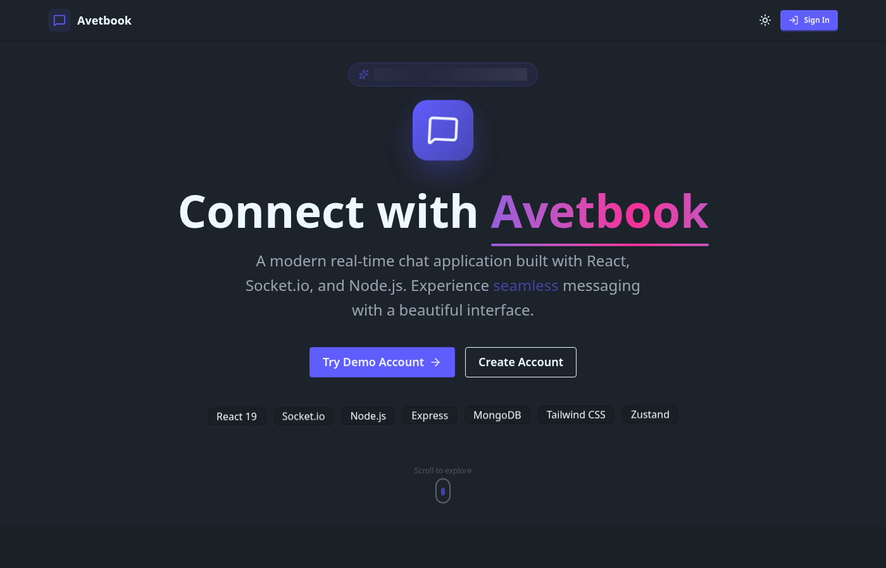
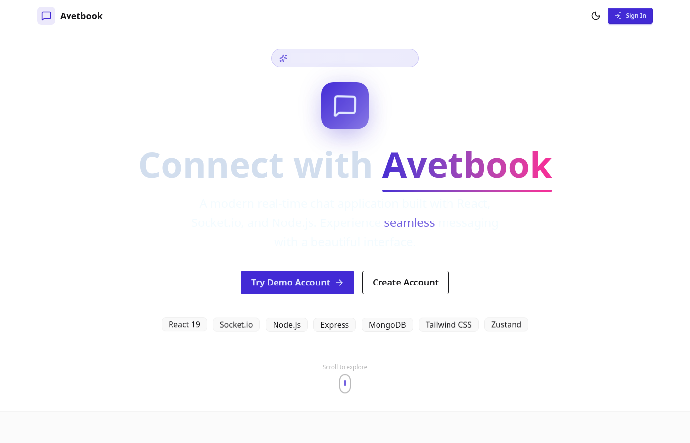
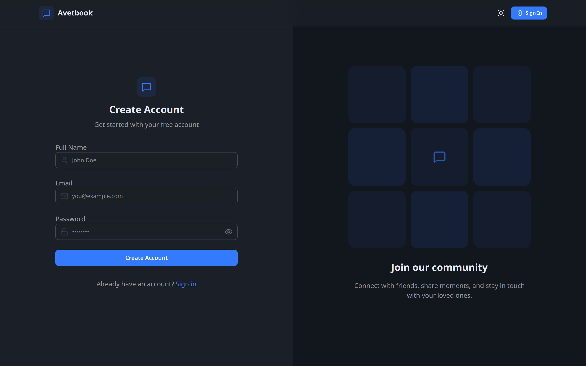
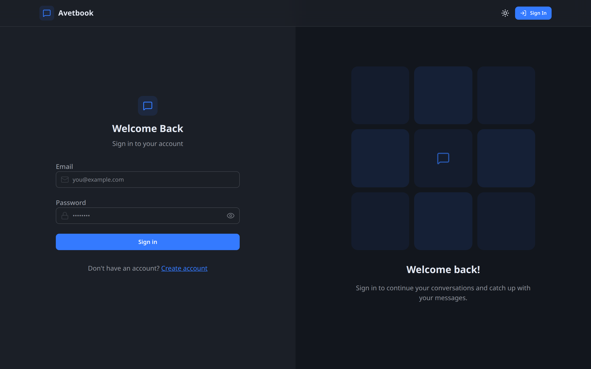
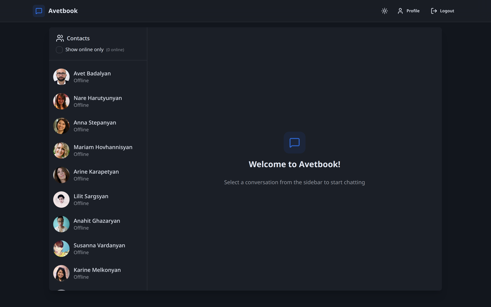
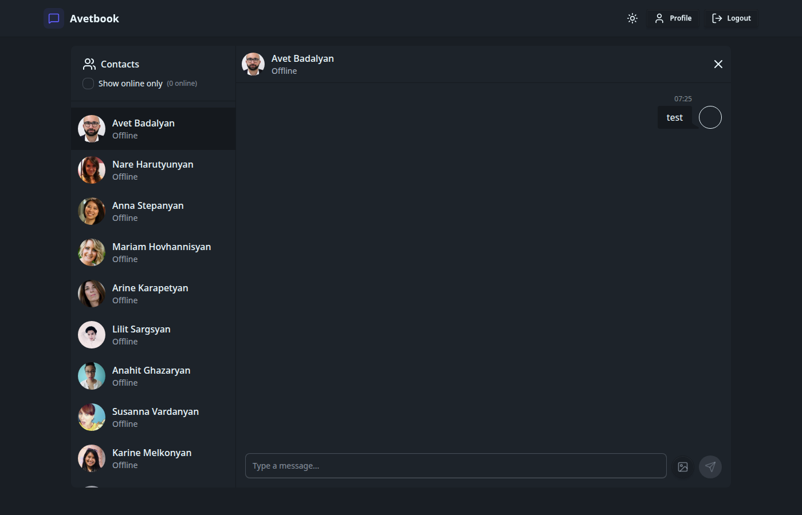
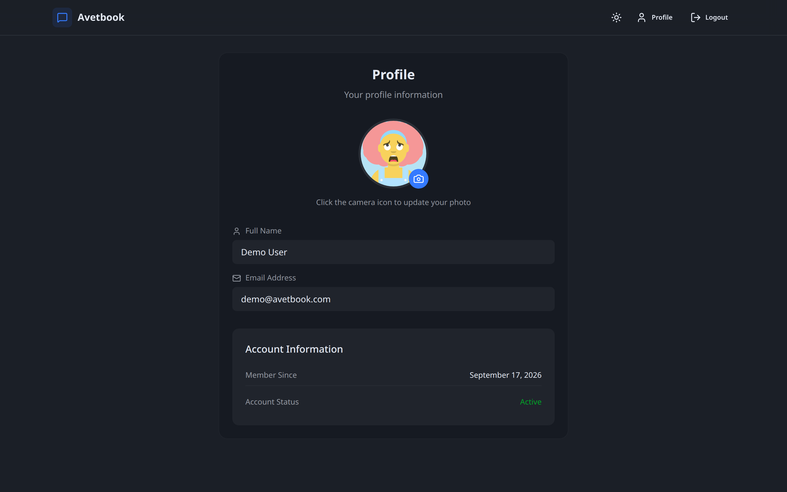
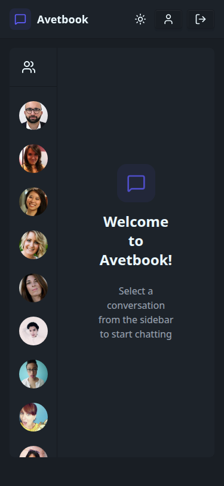
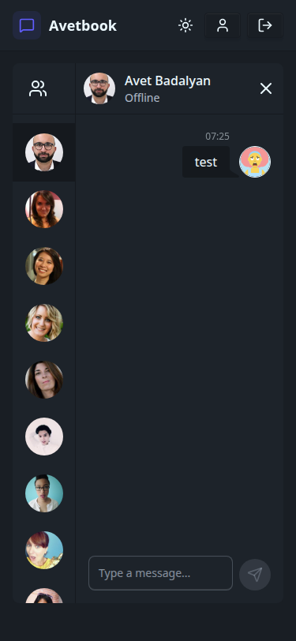

# Avetbook

A real-time chat application built with the MERN stack and Socket.io.

**[Live Demo](https://avetbook-chat-app.onrender.com)** — Try the demo account
to explore features instantly.



## Features

- **Real-time messaging** — Instant message delivery using WebSocket connections
- **Typing indicators** — See when someone is typing with debounced events
- **Message reactions** — React to messages with emoji (👍 ❤️ 😂 😮 😢 😡)
- **Unread message badges** — Track unread conversations with visual indicators
- **Online presence** — Live status showing who's currently online
- **Image sharing** — Send images with Cloudinary storage integration
- **32 themes** — A quick light/dark toggle plus a full DaisyUI theme picker,
  persisted to localStorage
- **Secure authentication** — JWT-based auth with HTTP-only cookies
- **Responsive design** — Mobile shows one panel at a time (contacts or the open
  chat); desktop shows both side by side
- **Accessibility** — Labelled icon controls and a `prefers-reduced-motion`
  fallback

## Tech Stack

| Layer     | Technology                                     |
| --------- | ---------------------------------------------- |
| Frontend  | React 19, Vite, Zustand, Tailwind CSS, DaisyUI |
| Backend   | Node.js, Express 5                             |
| Database  | MongoDB with Mongoose                          |
| Real-time | Socket.io                                      |
| Storage   | Cloudinary (images)                            |
| Auth      | JWT with HTTP-only cookies, bcrypt             |

## Architecture

```
┌─────────────────┐     WebSocket      ┌─────────────────┐
│                 │◄──────────────────►│                 │
│  React Client   │                    │  Express Server │
│  (Zustand)      │     REST API       │  (Socket.io)    │
│                 │◄──────────────────►│                 │
└─────────────────┘                    └────────┬────────┘
                                                │
                                                ▼
                                       ┌─────────────────┐
                                       │    MongoDB      │
                                       │   + Cloudinary  │
                                       └─────────────────┘
```

### Key Design Decisions

**Global Socket Subscription**  
Socket events are subscribed once on authentication, not per conversation. This
allows tracking messages from all users (for unread badges) rather than only the
selected conversation.

**Real-time Sync over REST + Sockets**  
Writes (send message, add reaction) go through the REST API so the server stays
the source of truth. The server then broadcasts the result over Socket.io to the
relevant participants, so every connected client stays in sync without polling.
Chat listeners are attached on the socket `connect` event rather than a timer,
avoiding a startup race.

**State Management with Zustand**  
Two stores separate concerns: `useAuthStore` (auth + socket lifecycle + online
users) and `useChatStore` (messages + users + typing + unread counts). Theme
preference lives in `useThemeStore` with localStorage persistence.

**Consistent Error Handling**  
The API returns a single `{ message }` error shape across every endpoint, and
the client normalizes any axios/network failure through one shared
`getErrorMessage` helper before surfacing a toast.

## Getting Started

### Prerequisites

- Node.js 20.19+
- MongoDB (local or Atlas)
- Cloudinary account (for image uploads)

### Environment Variables

Create `backend/.env`:

```env
MONGODB_URI=mongodb+srv://...
PORT=5001
JWT_SECRET=your-secret-key

CLOUDINARY_CLOUD_NAME=...
CLOUDINARY_API_KEY=...
CLOUDINARY_API_SECRET=...

NODE_ENV=development
```

### Installation

```bash
# Install dependencies for both frontend and backend
npm run build

# Start development servers (backend + frontend)
npm run dev
```

- Backend: http://localhost:5001
- Frontend: http://localhost:5173

### Seed Demo Data

```bash
cd backend
npm run seed
```

This creates a demo account (`demo@avetbook.com` / `demo123456`) and sample
users.

## Project Structure

```
├── backend/
│   ├── src/
│   │   ├── controllers/     # Route handlers
│   │   ├── lib/             # Utilities (db, socket, cloudinary)
│   │   ├── middleware/      # Auth middleware
│   │   ├── models/          # Mongoose schemas
│   │   ├── routes/          # Express routes
│   │   └── seeds/           # Database seeders
│   └── index.js
│
├── frontend/
│   ├── src/
│   │   ├── components/      # React components
│   │   ├── pages/           # Route pages
│   │   ├── store/           # Zustand stores
│   │   └── lib/             # Axios instance, utilities
│   └── index.html
```

## API Endpoints

### Authentication

| Method | Endpoint                   | Description            |
| ------ | -------------------------- | ---------------------- |
| POST   | `/api/auth/signup`         | Create account         |
| POST   | `/api/auth/login`          | Login                  |
| POST   | `/api/auth/logout`         | Logout                 |
| GET    | `/api/auth/check`          | Verify auth status     |
| PUT    | `/api/auth/update-profile` | Update profile picture |

### Messages

| Method | Endpoint                         | Description         |
| ------ | -------------------------------- | ------------------- |
| GET    | `/api/messages/users`            | Get all users       |
| GET    | `/api/messages/:userId`          | Get conversation    |
| POST   | `/api/messages/send/:userId`     | Send message        |
| POST   | `/api/messages/react/:messageId` | Add/remove reaction |

### Socket Events

| Event               | Direction       | Description               |
| ------------------- | --------------- | ------------------------- |
| `newMessage`        | Server → Client | New message received      |
| `messageReaction`   | Server → Client | Reaction added/removed    |
| `typing`            | Client → Server | User started typing       |
| `stopTyping`        | Client → Server | User stopped typing       |
| `userTyping`        | Server → Client | Someone is typing         |
| `userStoppedTyping` | Server → Client | Someone stopped typing    |
| `getOnlineUsers`    | Server → Client | Online users list updated |

## Screenshots

### Desktop

| Landing Page (Dark)                                | Landing Page (Light)                                 |
| -------------------------------------------------- | ---------------------------------------------------- |
|  |  |

| Sign Up                                | Login                                |
| -------------------------------------- | ------------------------------------ |
|  |  |

| Chat Home                                    | Chat Conversation                                            |
| -------------------------------------------- | ------------------------------------------------------------ |
|  |  |

| Profile                                  |
| ---------------------------------------- |
|  |

### Mobile

| Landing                                                | Chat List                                        | Conversation                                                     |
| ------------------------------------------------------ | ------------------------------------------------ | ---------------------------------------------------------------- |
|  |  |  |

## License

MIT
